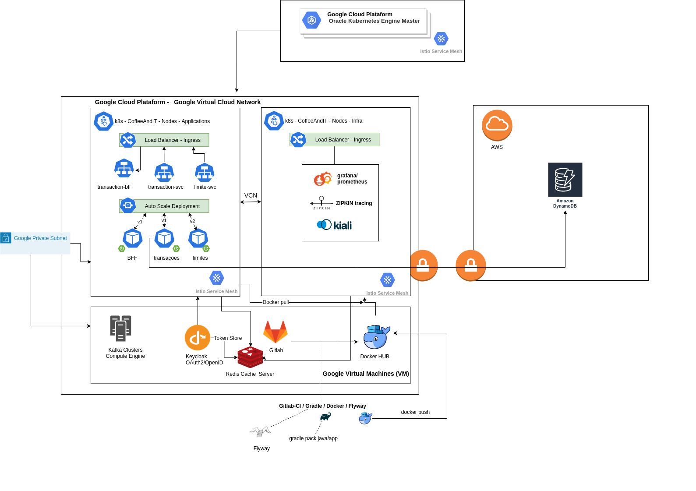

## BFF para proxy de Transações Financeiras.

Para subir local a aplicação executem o arquivo java TransactionProxyApplication com:

1) Ou subam passando o parâmetro -Dspring.profiles.active=dev
2) Ou renomeiem o arquivo de src/main/resources/application-dev.yaml para src/main/resources/application.yaml

Execução

1) gradle clean build
2) Subir localmente kafka, redis e zipkin
   Executar: docker-compose -f docker-compose-kafka-zipkin.yml up
3) gradle bootRun

